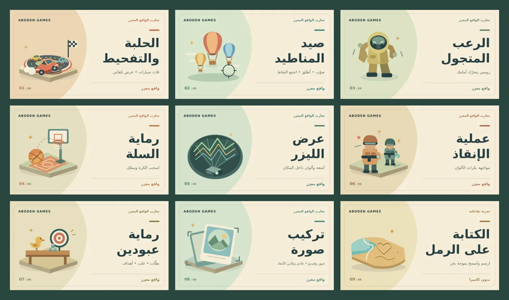

# AR-Aboden cards in the Motri experiments area

The Lab boards now contain the nine public experiences listed by
[AR-Aboden](https://github.com/3wasfnjd/AR-Aboden) at
`1d1a9449cf64eb1211d6d3ecc0a8323a73101ed4` (25 September 2026).
Each experience has its own original vector illustration, a large Arabic
title, warm paper colors, and a restrained accent matching the game world.



| Board title | Destination under `https://3wasfnjd.github.io/AR-Aboden/` |
| --- | --- |
| الحلبة والتفحيط | `arena.html` |
| صيد المناطيد | `balloons.html` |
| الرعب المتجول | `horror.html` |
| رماية السلة | `basketball.html` |
| عرض الليزر | `laser.html` |
| عملية الإنقاذ | `operation-ink-ar.html` |
| رماية عبودين | `gallery.html` |
| تركيب صورة | `photo.html` |
| الكتابة على الرمل | `sand.html` |

The photo card opens the existing chooser for normal and 3D modes. Developer
utilities, the marker page and legacy demos are not catalog experiences.
The current experience pages were also checked: the drift show has three
cars, the horror character is a hazmat zombie, and the former ink experiment
is now called عملية الإنقاذ. Sand is labeled as camera-free.

## Size and rendering

- Main cards: **768 × 432**, RGB WebP, **12.8–17.8 KB** each.
- Scroller cards: **256 × 144**, separately composed without small descriptions,
  **3.1–3.9 KB** each.
- All 18 runtime images together: **161,024 bytes** (157.25 KiB).
- The review sheet and SVG sources live under `resources/` and are not loaded
  by the game. There are no new models, shaders, live canvases, font downloads
  or per-frame card drawing operations.
- Existing loading behavior is retained: load the current main card and its
  next/previous neighbor; load thumbnails only when their panels are visible.
- Existing sRGB, `flipY = false`, linear filtering and no mipmaps are retained.
  Missing images fall back to the corresponding Arabic experience title.
- Versioned filenames avoid reusing cached older covers. Older unrelated lab
  assets remain in the repository but are not referenced by the new catalog.

`sources/data/lab.js` remains the single catalog consumed by the board, title,
URL interaction, scroller and the existing dynamic achievement target.
Navigation, camera transitions, opening links and the area's physical models
are unchanged.

## Editing

`scripts/build-lab-cards.mjs` contains the common layout and each illustration.
It writes editable SVG sources, both WebP sizes, a review sheet and `sizes.json`.
After installing the project's dependencies, run:

```sh
node scripts/build-lab-cards.mjs
```

The build tool uses the existing `sharp` dependency and system DejaVu Sans for
Arabic shaping. The deployed game uses the pre-rendered WebP files and does not
need that font. The generator checks catalog/art binding and image byte budgets.

## Verification

Reviewed all nine covers and a native-size miniature. All 18 WebPs passed
complete RIFF-length checks, full RGB decoding, dimension checks and individual
and total byte budgets. All nine links match actual pages in the source catalog.
Syntax checks passed for the edited JavaScript. The actual Lab GLB was inspected:
the main display uses a 16:9 plane; both display and mini UVs place `v = 0` at
the upper edge, matching the existing texture orientation.

The Pages build/deployment is the production check. No live GPU gameplay or
physical-phone AR session is claimed by these asset checks.
