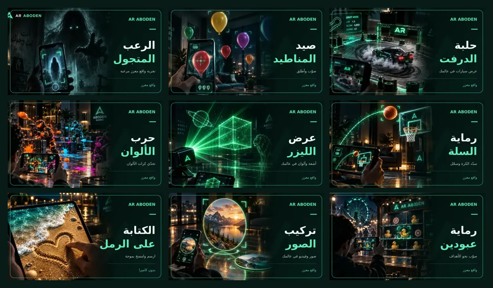

# AR-Aboden cards in Motri

The nine Lab experiences now use the user's dark emerald photographic card
style. Five posters were supplied by the user; four matching posters were
created with the built-in image generator for basketball, Color War, photo
placement and touch sand. These are promotional illustrations, not gameplay
screenshots. The full prompts are preserved in
`resources/lab-cards/neon/prompts.json`.



The paintball experiment is now called **حرب الألوان**. Its URL remains
`https://3wasfnjd.github.io/AR-Aboden/operation-ink-ar.html`; the AR-Aboden home
card, browser title and intro heading were renamed in commit
`384036e0f583489e01d589ecb797cf70c59f5ac1`.

## Runtime budget

| Asset | Dimensions | File size |
| --- | --- | --- |
| Main board card | 640 × 360 | 17.6–33.0 KB each |
| Scroller miniature | 256 × 144 | 4.5–8.1 KB each |
| All 18 game textures | RGB WebP | **293,422 bytes total** |
| Full portrait posters | 800 × 1000 | 50.1–108.8 KB each |

Portrait posters, generation prompts, review sheet and compression measurements
are kept under `resources/lab-cards/neon/`. They are not fetched by the game.
The full portrait set is 682,702 bytes; `compression.json` records the original
and compressed file sizes. The supplied JPEGs were reduced by approximately
82–85%, and the four generated PNGs by approximately 95–96%, including resizing.

The board layout keeps the scene artwork on the left and puts a large joined
Arabic title on a dark panel at the right. This preserves the 16:9 board ratio
instead of stretching the portrait posters. Miniatures omit small descriptions.
The sand card explicitly says **بدون كاميرا**.

The existing Lab geometry, UV orientation (`flipY = false`), sRGB conversion,
linear filters, no-mipmap configuration, navigation and click handling are
unchanged. Existing behavior loads a main card plus its neighbor, and miniature
images as their panels become visible. All filenames are versioned to avoid
stale cached artwork. No new models, runtime libraries or drawing loops.

## Rebuild

`sources/data/lab.js` is the catalog and link source. The photo entry opens the
existing normal/3D chooser. All nine URLs still point to their existing pages.

```sh
node scripts/build-lab-cards.mjs
```

The established command now delegates to `build-neon-lab-cards.mjs`, which uses
the committed compressed posters and the project's existing `sharp` dependency.
It requires system DejaVu Sans for Arabic shaping at export time. The game
requires no font download for these images. The script verifies catalog/art
binding and limits individual and combined output sizes. Prior vector sources
remain in version history and on disk but are not used by the catalog.

## Checks

- Visually inspected the four generated posters, all nine board cards, a native
  256 × 144 miniature, and the compressed sand poster.
- All 18 runtime WebPs passed complete RIFF-size checks, full RGB decoding,
  resolution checks and size budgets.
- Confirmed nine unique destination URLs and the Color War title/link pairing.
- The AR-Aboden rename changes only four visible title strings; experience code
  and its URL are unchanged.
- No live GPU gameplay or physical-device AR test is claimed by these checks.
