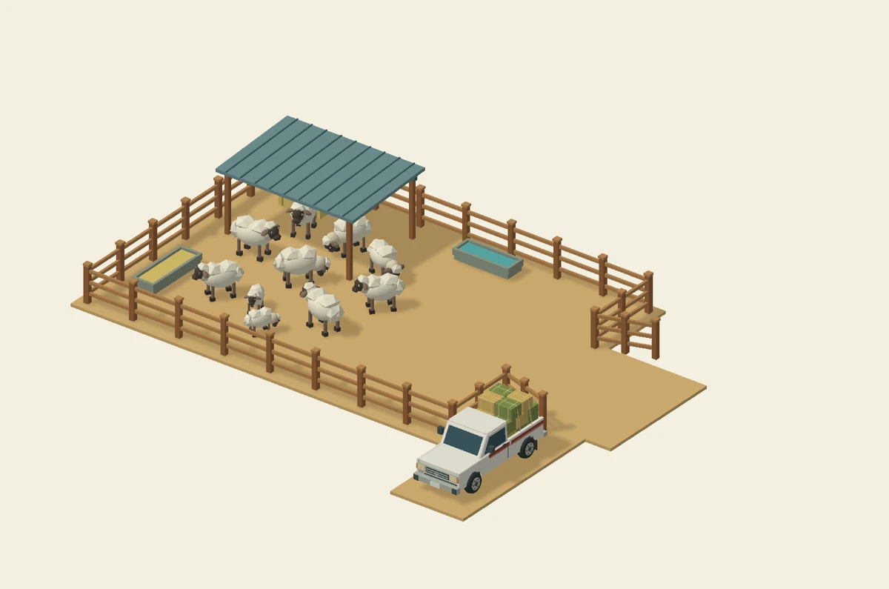

# حوش الغنم

The pen sits west of the circuit straight, south of the rest house. Its centre is
`(-55.5, 0, -13.7)` in world metres; its 4.8 m gate opens east towards the street.
The map location **حوش الغنم** uses the `sheepPen` respawn outside the gate.

`SheepPenSite.js` defines placement and terrain clearing. `SheepPenModel.js`
builds the fence, shade, troughs, hay and ten sheep, including two smaller lambs.
`SheepPenMotion.js` gives each animal independent short walks, standing pauses and
grazing. Shared head and leg instances animate looking, lowering the head and a
walking gait. Sheep choose clear routes around the fence, shade posts, hay and
feeders, keep apart, and step away from an approaching vehicle. The open gate's
eastern approach stays clear.

The model uses the game's lighting, fog and reveal material, vertex colours and
no image textures. It still has 7,848 rendered triangles and one material. Four
mesh batches cover the fixed scenery, bodies, heads and forty shared leg instances.
The existing 25 cuboid colliders are split into 15 static props and 10 kinematic
sheep bodies, which follow the visible sheep. Motion and instance updates run at
no more than 20 Hz and sleep beyond 45 m. No skeletal rigs or textures are added.

A white, maroon-striped single-cab Datsun-style feed pickup is parked beside the
entrance at `(-46.2, 0, -7.5)`, facing +Z. Its open bed carries six golden hay bales
and ten green alfalfa bales with twine and load ropes. It is fixed scenery and uses
the existing palette material: 4,736 triangles, one additional draw batch, three
cuboid colliders, four wheels and no textures, rig or update loop. Its body, glazing,
grille, wheel arches, steel rims and NISSAN tailgate strokes are original geometry.
The overall pen, parking pad and pickup total 12,596 triangles, five draws and
28 colliders. `SheepFeedPickup.js` builds the prop.

The flat parking bay is south of the open gate, between `x=-47.6..-44.6` and
`z=-11.1..-4.5`. Its full terrain feather stays outside the actual asphalt mesh,
including the nearby bend. The pad joins the existing approach without overlapping
its top faces. The 4.8 m entrance stays open; 201 samples of a 3.0 x 2.04 m car
fit along the approach. Parking uses the existing terrain/vegetation clearing so
both visible ground and collision heights agree. Existing asphalt and other
activity geometry were checked against the repository assets and remain unchanged.

`SheepPen.js` runs before the floor, vegetation and area constructors. It flattens
the site with a feathered edge, removes five intersecting vegetation references
from the current map, and opens the circuit boundary collider at the approach.
The asphalt and other activity geometry are preserved.

Validation: module syntax, actual map resource integration, terrain bounds,
day/night map overlay, and geometric clearance for a 3.0 × 2.04 m vehicle passed.
Driving and appearance in a browser remain to be checked.

Animation regression (after installing the game dependencies):

```sh
node --experimental-wasm-modules --loader ./scripts/camel-camp-test-loader.mjs scripts/test-sheep-pen-motion.mjs
```

This exercises two minutes of independent movement for all ten sheep, a vehicle
approach, fence/feeder/other-sheep avoidance, moving legs, planted idle hooves,
head motion, geometric bounds and ground clearance. The actual game physics and
Rapier WASM verify collider/visual synchronisation at 30 and 144 Hz, the 20 Hz
animation cap, distance sleep/resume and unchanged collider counts. The loader
only substitutes browser bootstrap/material dependencies for this Node test.

Run `node scripts/test-sheep-feed-pickup.mjs` for the pickup budget, cargo counts,
flat footprint, scene placement and gate clearance. A separate check with the
actual map resources verified the road gap, terrain heights, surrounding props
and both map themes. The preview is a neutral geometry render, not a game capture;
it is documentation only and is not loaded at runtime.



Visual reference: [Nissan pickup brochure](https://www.nissan-cdn.net/content/dam/Nissan/eg/brochures/Pickup.pdf).
No model or texture was downloaded or reused.
