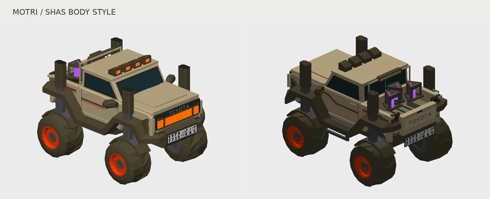
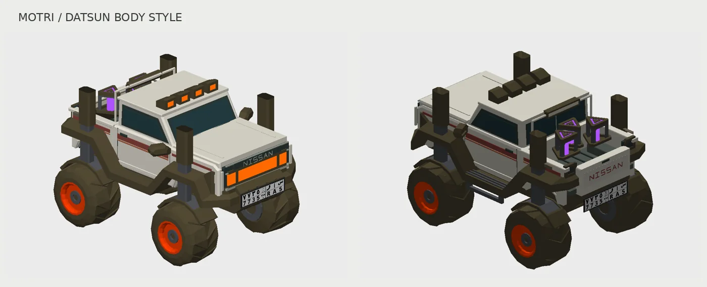

# Vehicle body styles

The playable vehicle now offers **هافال H9**, **شاص 2026** and **ددسن** under
**الإعدادات → شكل السيارة**. Press the button to switch. H9 remains the default;
the chosen skin is remembered locally. Blocked browser storage does not prevent
startup or changing the skin in the current session.

This follows the original H9 approach: only the visible body changes. The same
Simon vehicle continues to drive the world. No new physics vehicle, camera, input
mapping or gameplay profile is introduced.

## Preserved parts

- PhysicsVehicle.js, its colliders, mass, wheel offsets/radius, suspension,
  steering, acceleration, braking, boost and respawn behavior are unchanged.
- The four existing wheel groups, their geometry, materials, transforms and
  animation paths are unchanged; wheel-paint rewards continue to work.
- Existing headlights, roof lamps, blinkers, brake/reverse lights, antenna
  support, boost cells/trails, mirrors, bumpers and lower chassis stay in place.
- The current front/rear Saudi plates and their text/materials remain intact.
- Both existing vehicle GLBs and the parked camel-camp pickup are untouched.

`VehicleBodyStyles` hides only `bodyPainted` and the five named H9 body/badge
meshes. H9 visibility is restored when switching back. The new single-cab Shas
has matte beige paint, burgundy stripes, dark windows, an open bed, a headboard
supporting the original brake lamp, and TOYOTA lettering. Its proportions are
adapted to the existing gameplay chassis and fixed light locations, rather than
using the larger parked vehicle's dimensions. Forward remains +X, up +Y.

## Runtime cost

The Shas body has **2,376 triangles**; the white/red Datsun has **2,508 triangles**.
Each uses **two meshes/materials**, with the original four wheels and chassis.
Datsun adds a flat bonnet, straight red stripes, chrome grille trim and NISSAN
lettering. `PickupVehicleBody.js` shares the geometry helpers; the Shas geometry
and colors remain identical to the previous revision. Each body is constructed
only on its first selection and reused on subsequent selections. No new
textures, GLB downloads, lights, rigid bodies or per-frame update loops are added.
The two material types use the same world shading as existing scenery. The
inactive body is hidden and does not add normal render draws. Skin-owned
geometry/materials are disposed when the visual vehicle is destroyed.

## Validation

Run `node scripts/test-vehicle-body-styles.mjs` after installing the project
dependencies. It loads the actual uncompressed gameplay GLB and checks:

- 120 repeated swaps among all three styles preserve all 48 protected objects, transforms, geometry
  contents, materials, parent links and visibility states.
- The body fits within the existing vehicle bounds, has finite positions/unit
  normals, and each pickup builds only once with two draw meshes.
- Rays from all 44 original lamp triangles are unobstructed by the new body.
- Invalid selections, disabled storage and disposal behave correctly.

The compressed and standard assets have matching node contracts. Front, side
and rear geometry previews were inspected using the actual source meshes.
The preview is a CPU geometry render, not an in-game screenshot. Full visual
gameplay under WebGPU/WebGL is not available in the editing environment.

## Mobile boost control

A 54px circular lightning button appears on the physical right side only in touch
mode while driving or racing. Hold to use the existing boost action; release to
stop. It hides in menus, modals, the introduction, and desktop/gamepad modes.
This adds `Touch.boost` to the existing input action; engine forces, top-speed
settings and the keyboard/gamepad bindings are unchanged.

`Pointer` now reads canvas `targetTouches`, keeping the boost finger out of the
steering gesture while retaining two-finger canvas pinch gestures. Pointer up,
cancel, lost capture, page hide, blur, hidden tabs and input-filter changes release
only the touch boost source. The button uses an inline SVG and CSS; no image or
font downloads are added.

Run `node --experimental-vm-modules scripts/test-mobile-boost.mjs` for the actual
Inputs/Pointer/Nipple/MobileBoostButton logic with a simulated browser DOM. It
covers steering and boost in either finger order, release/cancellation, menu
changes, pinch handling, and preservation of keyboard/gamepad boost. These tests
do not substitute for a physical iPhone/Safari driving test. A local browser could
not be launched in this editing environment. Both regression scripts run in the
Pages build before publication.

