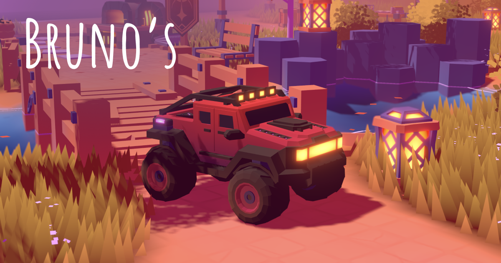

# موتري 2 — Motri2

## الهوية الحالية

أزيلت الهوية والمحتويات الشخصية والروابط الخارجية السابقة من واجهة اللعب. المناطق الثلاث عشرة والأنشطة والخريطة والإنجازات والخدمات وإعداداتها باقية. قاعات المعارض تعرض أماكن فارغة صريحة، لا مشاريع جديدة مختلقة. انتقال آلة الزمن الخارجي معطّل، وتفاعل التلفاز محفوظ.

تستبدل طبقة عرض مستقلة أحرف الاسم بقطع تفاعلية محايدة، والتمثال الشخصي بمجسم تجريدي، ولافتة الحلبة ومواد المسيرة والتلفاز بصور محايدة. أجسام التصادم والكتل والمواقع والتعليق والقيادة لم تتغير. تبقى ملفات GLB والأصوات الأصلية محفوظة للمرجعية، لكن المحتوى الشخصي المستبدل لا يُعرض.

إشعارات المصدر في static/credits.html وlicense.md. آلية اختبار النشر تتحقق من سلامة القيادة ومكونات العالم وإزالة الوجهات الشخصية. الخدمات الشبكية لم تُفعّل أو تُحذف ضمن هذا التعديل.

---

## سجل التأسيس والمصدر (مرجعي، لا يظهر داخل اللعبة)

# موتري 2 — Motri2

نسخة مستقلة مرجعية من **brunosimon/folio-2025** عند الإصدار **41046b57eeed8d156d9c3fd7fa259900baef7816**. مستودع موتري السابق لم يتغير ولا تعتمد هذه النسخة عليه.

## التعريب

النسخة العربية تعرّب القوائم والتعليمات والإنجازات والإشعارات والخريطة وعناوين التفاعل داخل المشهد وشاشة البدء ولوحة نتائج السباق. تدعم أسماء الدول والبحث عنها بالعربية، مع الاحتفاظ بمفاتيح التحكم ورموز الدول والحفظ كما هي. الخط العربي من خطوط النظام؛ لا أصول مدفوعة أو خدمات ترجمة وقت التشغيل.

النصوص المزخرفة المدمجة هندسيًا داخل بعض المجسمات، وأسماء المشاريع والعلامات والشعارات الأصلية، تبقى جزءًا من أصول برونو المرجعية؛ لم نغيّر ملفات GLB أو الصور لإخفاء نسبتها. ليست هذه ترجمة لأصوات أو محتوى المواقع الخارجية.

التغييرات في العرض والنصوص فقط: تظل ملفات السيارة والفيزياء وPlayer والمدخلات والكاميرا والتوقيت والأصول مطابقة للقاعدة. اختبارات المصدر والقيادة باقية، وتضاف إليها اختبارات القوائم العربية واتجاه النص وعناوين التفاعل. لا يزال اختبار آيفون الفعلي مطلوبًا.

## نطاق المرحلة الحالية

نقل المصدر وأصوله وملفات Blender، وتشغيل سيارة سايمون وقيادتها وكاميرتها والعالم الأصلي أولًا. هذه ليست غرفة المغامرة الجديدة أو النسخة النهائية. أبقينا العالم الأصلي للمرجعية ولا ننسب تصميمه إلى موتري.

تحكم الجوال الأصلي: إصبع واحد حول السيارة لتحديد الاتجاه والدعسة، وإصبعان للكاميرا. لم نضف المقود والدعسة المنفصلين بعد. الكيبورد: WASD أو الأسهم، B فرامل، Shift تعزيز، R إعادة، Space تعليق/قفز.

الفيزياء Rapier وأربع عجلات Raycast. لا تغيير في إعدادات القيادة أو الفيزياء أو موديل السيارة أو توقيت تحديثها. يحتفظ **.motri2/upstream.json** ببصمات SHA-256 لجميع ملفات المصدر المستوردة للتحقق من ذلك.

## تغييرات الاستضافة فقط

عنوان وشريط مرجعي باسم موتري 2، وتصحيح روابط تهيئة الصفحة لمسار Motri2، وإزالة تحليلات الموقع الأصلي. وصلة السيرفر فارغة؛ اللعب المحلي مستقل عن سيرفر برونو والخدمات الشبكية المشتركة ليست مفعلة. الأصول محلية، لكن الخطوط الخارجية الأصلية ما زالت تطلب Google Fonts.

البناء والاختبارات والنشر في **.github/workflows/pages.yml**. اختبار Chromium الآلي لا يثبت أداء Safari أو WebGPU على آيفون فعلي.

## التشغيل

شغّل **npm ci --force --ignore-scripts** ثم **npm run dev**، وللبناء **npm run build**. إعدادات النشر العامة في **.env.production**. للتطوير بنفس الخيارات انسخها إلى **.env.local**؛ لا تتضمن مفاتيح خاصة.

## المصدر والحقوق

ملف **license.md** محفوظ باسم Bruno Simon. حقوق الأصول والمكتبات لا تحذف ولا يعاد نسبتها إلى موتري. لا شراء أو توليد أصول ضمن هذه الخطوة.

---

## توثيق المصدر الأصلي

# Folio 2025



## Setup

Create `.env` file based on `.env.example`

Download and install [Node.js](https://nodejs.org/en/download/) then run this followed commands:

``` bash
# Install dependencies
npm install --force

# Serve at localhost:1234
npm run dev

# Build for production in the dist/ directory
npm run build
```

## Game loop

#### 0

- Time
- Inputs

#### 1

- Player:pre-physics (Inputs)

#### 2

- PhysicalVehicle:pre-physics (Player:pre-physics)

#### 3

- Physics

#### 4

- PhysicsWireframe (Physics)
- Objects (Physics)

#### 5

- PhysicalVehicle:post-physics (Player:pre-physics)

#### 6

- Player:post-physics (Physics, PhysicalVehicle:post-physics)

#### 7

- View (Inputs, Player:post-physics)

#### 8

- Intro
- DayCycles
- YearCycles
- Weather (DayCycles, YearCycles)
- Zones (Player:post-physics)
- VisualVehicle (PhysicalVehicle:post-physics, Inputs, Player:post-physics, View)

#### 9

- Wind (Weather)
- Lighting (DayCycles, View)
- Tornado (DayCycles, PhysicalVehicle)
- InteractivePoints (Player:post-physics)
- Tracks (VisualVehicle)

#### 10

- Area++ (View, PhysicalVehicle:post-physics, Player:post-physics, Wind)
- Foliage (VisualVehicle, View)
- Fog (View)
- Reveal (DayCycles)
- Terrain (Tracks)
- Trails (PhysicalVehicle)
- Floor (View)
- Grass (View, Wind)
- Leaves (View, PhysicalVehicle)
- Lightnings (View, Weather)
- RainLines (View, Weather, Reveal)
- Snow (View, Weather, Reveal, Tracks)
- VisualTornado (Tornado)
- WaterSurface (Weather, View)
- Benches (Objects)
- Bricks (Objects)
- ExplosiveCrates (Objects)
- Fences (Objects)
- Lanterns (Objects)
- Whispers (Player)

#### 13

- InstancedGroup (Objects, [SpecificObjects])

#### 14

- Audio (View, Objects)
- Notifications
- Title (PhysicalVehicle:post-physics)

#### 998

- Rendering

#### 999

- Monitoring

## Blender

### Export

- Mute the palette texture node (loaded and set in Three.js `Material` directly)
- Use corresponding export presets
- Don't use compression (will be done later)

### Compress

Run `npm run compress`

Will do the following

#### GLB

- Traverses the `static/` folder looking for glb files (ignoring already compressed files)
- Compresses embeded texture with `etc1s --quality 255` (lossy, GPU friendly)
- Generates new files to preserve originals

#### Texture files

- Traverses the `static/` folder looking for `png|jpg` files (ignoring non-model related folders)
- Compresses with default preset to `--encode etc1s --qlevel 255` (lossy, GPU friendly) or specific preset according to path
- Generates new files to preserve originals

#### UI files

- Traverses the `static/ui.` folder looking for `png|jpg` files
- Compresses to WebP

#### Resources

- https://gltf-transform.dev/cli
- https://github.com/KhronosGroup/KTX-Software?tab=readme-ov-file
- https://github.khronos.org/KTX-Software/ktxtools/toktx.html
