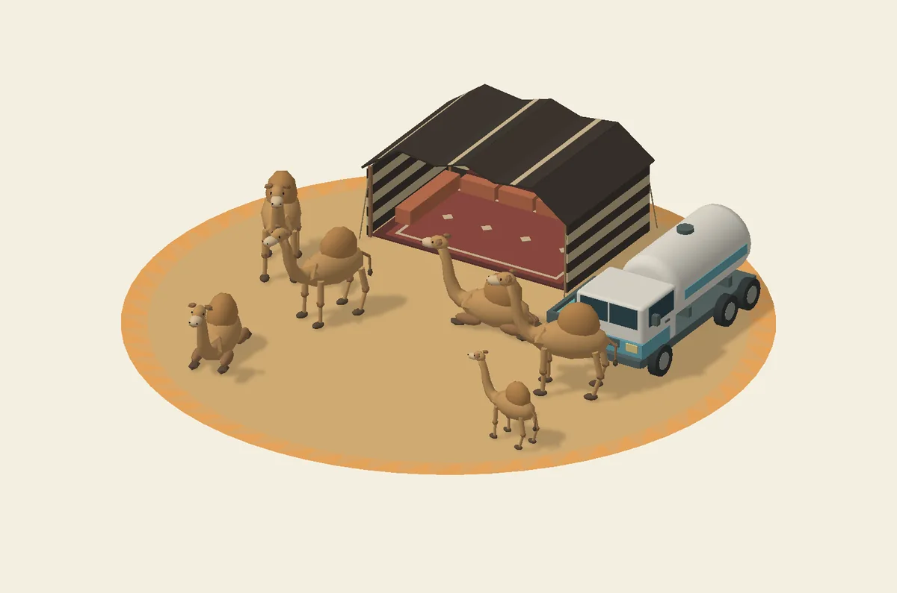

# Motri camel camp

Six original stylized dromedaries occupy the unused circular clearing north of
Career, labelled **قاعة العرض** in Arabic. The camp is centred at `(26, 0, -21)`,
with an 8.6 m sand radius and a 0.8 m terrain blend. It has three standing adults,
one standing calf and two kneeling adults, an open-front striped goat-hair tent,
a six-wheel water tanker, and a drinking trough connected by a hose.

The **مراح الإبل** map marker places the vehicle on the open southern apron at
`(26, 3, -14.2)`. Existing roads, the exhibition panels and other activity geometry
are preserved. Four overlapping vegetation references are removed before their
visual/physics instances are created. Terrain rendering and collision use the same
circular flattening region; the outer edge blends into the existing ground.

`CamelCampModel.js` builds the geometry with the game's shared lighting, shadows,
fog and reveal material. There are 9,836 rendered triangles, 4,708 source geometry
triangles, five draw batches, one material and twelve simple colliders.
There are no runtime textures or external model downloads. At rest, only the shared
neck/head instance buffer changes at 30 Hz; bodies and feet stay fixed. Animation
sleeps when the vehicle is more than 50 m away, after any active recovery finishes.
The truck is scenery, not a new drivable vehicle.

Nearby crate explosions launch the camels using the game's existing Rapier impulse
and distance falloff. Only affected camels switch from fixed to dynamic bodies;
the tent, tanker and trough remain fixed. Each camel returns to its original
position, heading and standing/kneeling pose six seconds after the last nearby
blast. If the vehicle occupies that spot, return waits until it is clear. Recovery
also completes offscreen. Bodies and heads share the same transform, and instance
bounds follow the displaced animals. The six camel colliders are reused, with no
new geometry, materials, draw batches or physics allocations on each explosion.

Run `node scripts/test-camel-camp.mjs` after installing the game's dependencies.
Geometry, six head poses, stationary feet, the spawn and 81 samples along a
3.0 x 2.04 m vehicle approach are checked. Integration was also exercised against
the repository's actual terrain, scenery, area and planting assets: original
scenery/area geometry stayed unchanged, 104 camp terrain vertices were flat,
11 terrain heights changed, and the rest of the terrain was preserved. Map drawing
was checked in day/night modes. The actual ticker updates nearby camels and sleeps
when distant. Syntax checks pass. No live browser driving or mobile frame-rate
measurement was possible in the GPU-less inspection environment.

Run the explosion regression with the game's installed Rapier dependency:

```sh
node --experimental-wasm-modules --loader ./scripts/camel-camp-test-loader.mjs scripts/test-camel-camp-blasts.mjs
```

It runs the production explosion, object, physics and camp modules with actual
Rapier WASM; only browser bootstrap/material dependencies are replaced. It checks
the crate-strength impulse, all six camels at 30/144 Hz, head/body alignment and
render bounds, repeated blasts, distant and vehicle-only exclusions, offscreen
recovery, occupied respawn positions and stable collider counts.

The image below is a neutral render of the generated geometry, not an in-game capture.
It is for documentation and is not loaded by the game.


